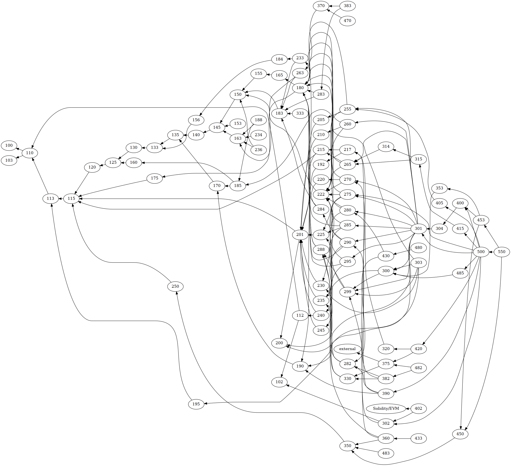

#   `curriculum`

_A comprehensive and up-to-date developer education platform for Urbit._



_Figure.  General Mathemic Inventory (GMI)._

This project organizes developer capabilities into a hierarchy of competencies (“objectives”), competency clusters (“lessons”), and ultimately developer education paths.

Given a particular target capability, we can answer the question of exactly what parts of the system you need to learn to be competent at your task.

We use this to produce three products:

1.  [Hoon School Live](./hoon-school-live--2022.2.md), the cohort-based class for new developers.
2.  [App School Live](./app-school-live--2022.6.md), the cohort-based class for developers who know Hoon.
3.  Hoon School Revenant, the new form of written Hoon School docs on `developers.urbit.org`.

---

Particular paths can be traced through the competency cluster dependencies.  The point isn't to make this overly complicated, it's to make sure that we know what you need to know to accomplish a particular task.

A competency cluster looks like this:

```
uuid: 110
layout: node
title: "Syntax, nouns, auras"
tags:
 - "%hoon"
prerequisites:
  - "100"
postrequisites:
  - "112"
  - "113"
objectives:
  - "Distinguish nouns, cells, and atoms."
  - "Apply auras to transform an atom."
  - "Identify common Hoon molds, such as cells, lists, and tapes."
  - "Annotate Hoon code with comments."
runes:
  - "::"
irregular:
  - "@"
  - "[]"
  - "~[]"
  - "''"
  - """"
key_points: []
assessments: []
comments: ""
content: ""
```

with some associated `content` from [urbit.org](https://urbit.org/docs) tutorials and docs.  What we are aiming for is that each objective have a quantitative measurable outcome; that is, we should be able to definitively say that one can “identify the special role of the `$` buc arm in many cores.”  The whole chart looks complicated because some things (like how Jael works, 240 and 290) depend on different prerequisites (in this case, some Azimuth background and how `move`s work).

---

The source of truth in the current version of `curriculum` is the collection of lesson nodes in YAML files.  The `curriculum-processor.ipynb` notebook will read these off and use them to produce an up-to-date `curr-raw.csv` file.
