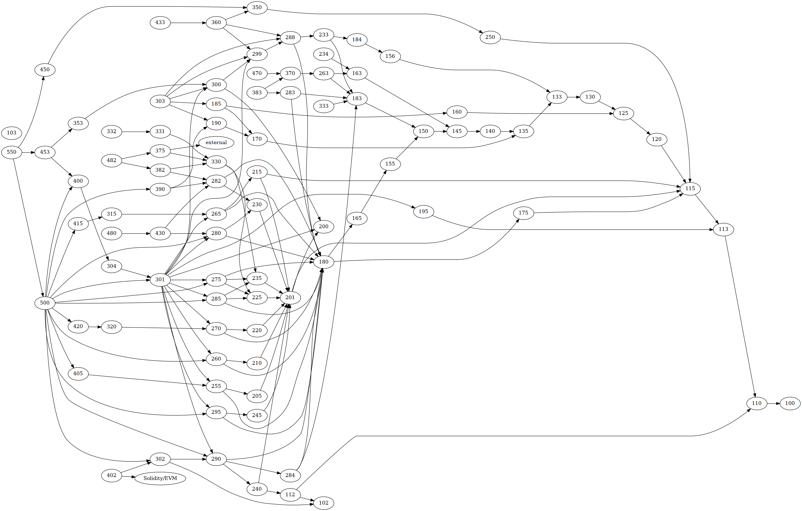

# curriculum

_A comprehensive and up-to-date developer education platform for Urbit._

This project organizes developer capabilities into a hierarchy of competencies (“objectives”), competency clusters (“lessons”), and ultimately developer education paths.

Given a particular target capability, we can answer the question of exactly what parts of the system you need to learn to be competent at your task.

I am currently working on making this more legible, and ultimately will use this to rework Hoon School, Hoon 101, and organize access to recommended study materials and documentation.

