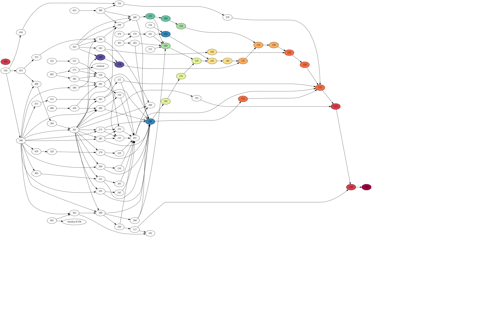

After Lesson 0, you should be able to:

- Explain what an Urbit ship is.
- Identify the `.urb/` directory.
- Distinguish a fakeship from a liveship.
- Use the `+ls` generator to show a directory's contents.
- `|mount` and `|commit` a desk.

---

After Lesson 1, you should be able to:

- Distinguish nouns, cells, and atoms.
- Apply auras to transform an atom.
- Identify common Hoon molds, such as cells, lists, and tapes.
- Annotate Hoon code with comments.
- Pin a face to the subject.
- Make a decision at a branch point.
- Distinguish loobean from boolean operations.
- Slam a gate (call a function).
- Produce a generator to convert a value between auras.
- Pronounce ASCII characters per standard Hoon developer practice.

You will know the runes:

- `::`
- `%-`
- `=/`
- `?:`
- `^-`
- `~&`
- ``

---

After Lesson 2, you should be able to:

- Identify current known irregular syntax.
- Convert between regular and irregular forms of runes to date.
- Identify a mold in the hierarchy of Urbit types (nouns, molds, marks).
- Understand how type inference and type checking takes place.
- Bunt a mold.
- Produce a type union.
- Produce a named tuple.
- Identify type using `!>`.
- Identify common Hoon patterns: atoms, cells, cores, faces, and traps.
- Identify cores as `[battery payload]` cells.
- Produce a gate as a generator.
- Build code samples with `-build-file` thread.
- Discuss Ford import runes.

You will know the runes:

- `^+`
- `$?`
- `$_`
- `$:`
- `^*`
- `!>`
- `|=`
- `!!`
- `/-`
- `/*`
- `/=`

---

After Lesson 3, you should be able to:

- Employ a trap to produce a reentrant block of code.
- Produce a recursive gate.
- Distinguish head and tail recursion.
- Consider Hoon structures as cores.
- Identify the special role of the `$` buc arm in many cores.
- Order neighboring cores within the subject for addressibility.
- Address nodes in a tree using numeric notation.
- Address nodes in a tree using lark notation.
- Address data in a tree using faces.
- Distinguish `.` and `:` notation.
- Diagram Hoon structures such as gates into the corresponding abstract syntax tree.

You will know the runes:

- `|-`
- `.+`
- `%=`
- `|%`
- `++`
- `=<`
- `=>`
- `=+`

---

After Lesson 4, you should be able to:

- Use lists to organize data.
- Convert between kinds of lists (e.g. tapes).
- Diagram lists as binary trees.
- Operate on list elements using `snag`, `find`, `weld`, etc.
- Import a library using `/+` faslus.
- Create a new library in `/lib`.
- Review Unicode text structure.
- Distinguish cords and tapes and their characteristics.
- Transform and manipulate text using text conversion arms.
- Interpolate text.
- Employ sigpam logging levels.

You will know the runes:

- `/+`
- `~&  >>>`

---

After Lesson 5, you should be able to:

- Identify the structure of a door and relate it to a core.
- Pull an arm in a door.
- Identify the `$` buc arm in several structures and its role.
- Review Unicode text structure.

You will know the runes:

- `|_`
- `%~`
- `|.`

---

After Lesson 6, you should be able to:

- Use assertions to enforce type constraints.
- Identify a `lest` (as opposed to a list).
- Produce a type arm.
- Identify units, sets, maps, and compound structures like jars and jugs.
- Explain why units and vases are necessary.
- Use helper arms and syntax:  `` ` ``, `biff`, `some`, etc.

You will know the runes:

- `?>`
- `?<`
- `?~`
- `+$`

---

After Lesson 7, you should be able to:

- Produce loobean expressions.
- Reorder conditional arms.
- Switch against a union with or without default.
- Reel, roll, turn a list.
- Curry, cork functions.
- Change arity of a gate.

You will know the runes:

- `?|`
- `?&`
- `?!`
- `?.`
- `?-`
- `?+`
- `;:`

---

After Lesson 8, you should be able to:

- Create a `%say` generator.
- Identify how Dojo sees and interprets a generator as a cell with a head tag.
- Identify the elements of a `sample` for a `%say` generator.
- Produce a `%say` generator with optional arguments.
- Discuss stateful v. stateless applications and path dependence.
- Enumerate Hoon's tools for dealing with state:  `=.` tisdot, `=^` tisket, `;<` micgal, `;~` micsig.
- Defer a computation.

You will know the runes:

- `:-`
- `=.`
- `=^`
- `;<`
- `;~`

---

After Lesson 9, you should be able to:

- Distinguish errors, faults, and failures.
- Distinguish latent, masked, and manifest errors.
- Enumerate and identify common error messages.
- Employ a debugging strategy to identify and correct errors in Hoon code.
- Run existing unit tests.
- Produce a unit test.
- Produce a desk suitable for distribution.
- Install and distribute software using Grid.
- Explain elements of a docket file.

You will know the runes:

- `!:`
- `!.`
