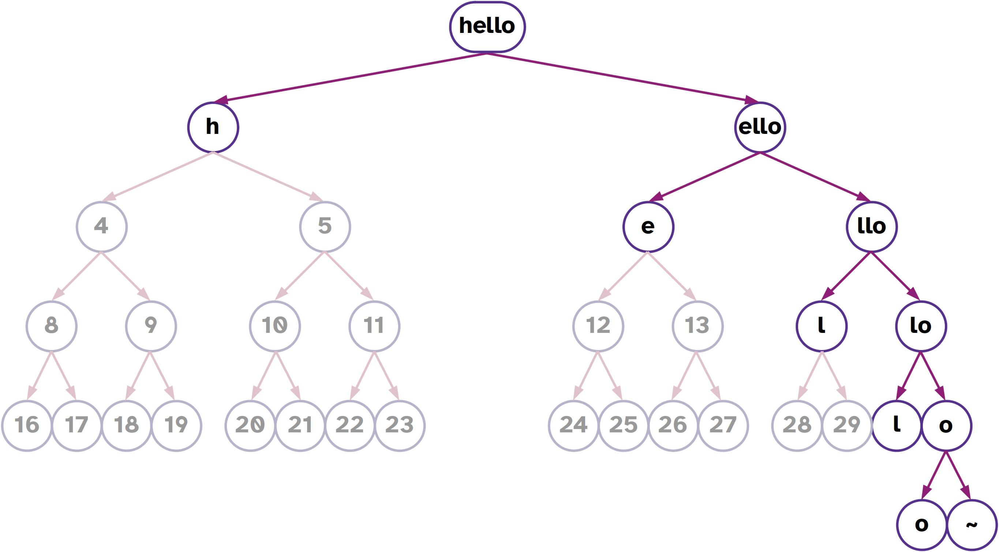

# Repeating Yourself & Addressing
##  Repeating Yourself (Recursion)

> "My formula for greatness in a human being is _amor fati_: that one wants nothing to be different, not forward, not backward, not in all eternity. Not merely bear what is necessary, still less conceal it—all idealism is mendacity in the face of what is necessary—but _love_ it."  (Nietzsche, _Ecce Homo_)

Computers were built and designed to carry out tasks which were too dainty and temperamental for humans to repeat consistently, or too prodigiously numerous for humans to ever complete.  At this point, you know how to build code that can make a decision between two branches, two different Hoon expressions.  Computers can decide between alternatives, but they also need to carry out a task until some condition is met.  (We can think of it as a recipe step, like "crack five eggs into a bowl".  Until that process is complete, we as humans continue to carry out the equivalent action again and again until the number is complete.)

We call this a “loop” in computer programming.  It describes the situation in which we set up some condition, and repeat a process over and over until something we do meets that condition.  _Most_ of the time, this means counting once for each item in a collection, like a list.

The [`|-` barhep](https://urbit.org/docs/hoon/reference/rune/bar#-barhep) rune creates a structure called a _trap_.  (Think of the “trap” in the bottom of your sink.)  It means a point to which you can return again, perhaps with some key values (like a counter) changed.  Then you can repeat the calculation inside the trap again.  This continues until some single value, some noun, results, thereby handing a value back out of the expression.  (Remember that every Hoon expression results in a value.)

This program adds 1+2+3+4+5 and returns the sum:

```hoon
=/  counter  1
=/  sum  0
|-
?:  (gth counter 5)
  sum
%=  $
  counter  (add counter 1)
  sum      (add sum counter)
==
```

(The last two lines happen “simultaneously”.)

Let's unroll it:

0.  `counter = 1`
    `sum = 0`
1.  `(gth counter 5) = %.n`
    `counter ← (add counter 1) = 2`
    `sum ← (add sum counter) = 0 + 1 = 1`
2.  `(gth counter 5) = %.n`
    `counter ← (add counter 1) = 3`
    `sum ← (add sum counter) = 1 + 2 = 3`
3.  `(gth counter 5) = %.n`
    `counter ← (add counter 1) = 4`
    `sum ← (add sum counter) = 3 + 3 = 6`
4.  `(gth counter 5) = %.n`
    `counter ← (add counter 1) = 5`
    `sum ← (add sum counter) = 6 + 4 = 10`
5.  `(gth counter 5) = %.n`
    `counter ← (add counter 1) = 6`
    `sum ← (add sum counter) = 10 + 5 = 15`
6.  `(gth counter 5) = %.y`

(And thus `sum` has the final value of `15`.)

It is frequently helpful, when constructing these, to be able to output the values at each step of the process.  Use the [`~&` sigpam](https://urbit.org/docs/hoon/reference/rune/sig#-sigpam) rune to create output without changing any values:

```hoon
=/  counter  1
=/  sum  0
|-
~&  "counter:"
~&  counter
~&  "sum:"
~&  sum
?:  (gth counter 5)
  sum
%=  $
  counter  (add counter 1),
  sum      (add sum counter))
==
```

You can do even better using _interpolation_:

```hoon
=/  counter  1
=/  sum  0
|-
~&  "counter: {<counter>}"
~&  "sum: {<sum>}"
?:  (gth counter 5)
  sum
%=  $
  counter  (add counter 1),
  sum      (add sum counter))
==
```

Another example:  let's calculate a factorial.  (This is not the most efficient way to do this!)  We will introduce a couple of new bits of syntax and a new gate (`++dec`).  Make this into a generator `fact.hoon`:

```hoon
|=  n=@ud
|-
~&  n
?:  =(n 1)
  n
%+  mul
n
%=  $
  n  (dec n)
==
```

- We are using the `=` irregular syntax for `.=` dottis, test for equality of two values.
- We are using the `+` irregular syntax for `.+` dotlus, increment a value (add one to a value).
- Why do we return the result (`product` in Hoon parlance) at 1 instead of 0?

One more thing:  as we write more complicated programs, it is helpful to learn to read the runes:

```
=/
  n
  15
  |-
    ~&
      n
      ?:
        =(n 1)      :: .=  n  1
        n
      %+
        mul
        n
        %=
          $
          n
          (dec n)   :: %-  dec  n
        ==
```

As we move on from this lesson, we are going to revert to the irregular form.  If you would like to see exactly how one is structured, you can use the [`!,` zapcom](https://urbit.org/docs/hoon/reference/rune/zap#-zapcom) rune.  `!,` zapcom produces an annotated _abstract syntax tree_ (AST) which labels every value and expands any irregular syntax into the regular runic form.

```hoon
> !,  *hoon  (add 5 6)
[%cncl p=[%wing p=~[%add]] q=~[[%sand p=%ud q=5] [%sand p=%ud q=6]]]
```

```hoon
> !,  *hoon  |=  n=@ud  
 |-  
 ~&  n  
 ?:  =(n 1)  
   n  
 %+  mul  
 n  
 %=  $  
   n  (dec n)  
 ==  
[ %brts  
 p=[%bcts p=term=%n q=[%base p=[%atom p=~.ud]]]  
   q  
 [ %brhp  
     p  
   [ %sgpm  
     p=0  
     q=[%wing p=~[%n]]  
       r  
     [ %wtcl  
       p=[%dtts p=[%wing p=~[%n]] q=[%sand p=%ud q=1]]  
       q=[%wing p=~[%n]]  
         r  
       [ %cnls  
         p=[%wing p=~[%mul]]  
         q=[%wing p=~[%n]]  
         r=[%cnts p=~[%$] q=~[[p=~[%n] q=[%cncl p=[%wing p=~[%dec]] q=~[[%wing p=~[%n]]]]]]]  
       ]  
     ]  
   ]  
 ]  
]
```

(_There's a lot going on in there._  Focus on the four-letter runic identifiers:  `%sgpm` for `~&` sigpam, for instance.)

> ##  Calculate a sequence of numbers
>
> Produce a gate (generator) which accepts a `@ud` value and
> calculates the series where each term is described by
> 
> $$
> n_{i} = i^{2}
> \textrm{,}
> $$
>
> that is, the first numbers are 0, 1, 4, 9, 16, 25, etc.
>
> You do not need to store these values in a list; simply output
> them at each step using `~&` sigpam and return the final value.
{: .challenge}

> ##  Output each letter in a `tape`
>
> Produce a gate (generator) which accepts a `tape` value and
> prints out each letter in order on a separate line.
>
> For example, given the `tape` `"hello"`, the generator should 
> print out
> 
> 'h'
> 'e'
> 'l'
> 'l'
> 'o'
>
> You do not need to store these values in a list; simply output
> them at each step using `~&` sigpam and return the final value.
> 
> You can retrieve the _n_-th element in a `tape` using the 
> `++snag` gate:
> 
> ```
> > =/  n  0  (snag n "hello")
> 'h'
> ```
> 
> (Note that `++snag` counts starting at zero, not one.)
{: .challenge}


##  Cores

So far we have introduced and worked with a few key structures:

1. Nouns
2. Molds (types)
3. Gates
4. Traps

Some of them are _data_, like raw values:  `0x1234.5678.abcd` and `[5 6 7]`.  Others are _code_, programs that do something.  What unifies all of these under the hood?

A core is a cell pairing operations to data.  (Think back to Lesson -1:  we have state, data, and operations.  Cores represent two of these.)  Formally, we'll say a core is a cell `[battery payload]`, where `battery` describes the things that can be done (the operations) and `payload` describes the data on which those operations rely.

(I feel like “battery” evokes the voltaic pile more than a bank of guns, but the latter actually does something directly.  Actually, come to think of it this is entirely an artillery metaphor.)

**Cores are the most important structural concept for you to grasp in Hoon.**  Everything nontrivial is a core.  Some of the runes you have used already produce cores, like the gate.  That is, a gate marries a `battery` (the operating code) to the `payload` (the input values AND the “subject” or operating context).

Urbit adopts an innovative programming paradigm called “subject-oriented programming.”  By and large, Hoon (and Nock) is a functional programming language in that running a piece of code twice will always yield the same result.

However, Hoon also very carefully bounds the known context of any part of the program as the _subject_.  Basically, the subject is the noun against which any arbitrary Hoon code is evaluated.

For instance, when we first composed generators, we made what are called “naked generators”:  that is, they do not have access to any information outside of the base subject (Arvo, Hoon, and `%zuse`) and their sample (arguments).  Other generators (such as `%say` generators, described below) can have more contextual information, including random number generators and optional arguments, passed to them to form part of their subject.

Cores have two kinds of values attached:  arms and legs, both called limbs.  Arms describe known labeled addresses (with `++` luslus or `+$` lusbuc) which carry out computations.  Legs are limbs which store data.


### Arms

An [_arm_](https://urbit.org/docs/glossary/arm) is a Hoon expression to be evaluated against the core subject (i.e. its parent core is its subject).

Within a core, we label arms as Hoon expressions (frequently `|=` bartis gates) using the [`++` luslus](https://urbit.org/docs/hoon/reference/rune/lus#-luslus) digraph.  (`++` isn't formally a rune because it doesn't actually change the structure of a Hoon expression.)

```hoon
|%
++  add-one
  |=  a=@ud
  ^-  @ud
  (add a 1)
++  sub-one
  |=  a=@ud
  ^-  @ud
  (sub a 1)
--
```

(The `--` hephep limiter is used because `|%` barcen can have any number of arms attached.)

We can also define custom types using [`+$` lusbuc](https://urbit.org/docs/hoon/reference/rune/lus#-lusbuc) digraphs.  We won't do much with these yet but they will come in handy for custom types later on.

This core defines a set of types intended to work with playing cards:

```hoon
|%
+$  suit  ?(%hearts %spades %clubs %diamonds)
+$  rank  ?(1 2 3 4 5 6 7 8 9 10 11 12 13)
+$  card  [sut=suit val=rank]
+$  deck  (list card)
---
```

When we write generators, we can include helpful tools as arms either before the main code (with `=>` tisgar) or after the main code (with `=<` tisgal):

```hoon
|=  n=@ud
=<
(add-one n)
|%
++  add-one
  |=  a=@ud
  ^-  @ud
  (add a 1)
--
```

A library is typically structured as a `|%` barcen core.

### Legs

A [_leg_](https://urbit.org/docs/hoon/hoon-school/the-subject-and-its-legs) is a data value.  They tend to be rather trivial but useful ways to pin constants.

For instance, to pin the value of π to a core:

```hoon
|%
++  pi  .3.1415926535
--
```


##  Addressing Limbs

Everything in Urbit is a binary tree.  And all code in Urbit is also represented as data.  One corollary of these facts is that we can access any arbitrary part of an expression, gate, core, whatever, via addressing (assuming proper permissions, of course).  (In fact, we can even hot-swap parts of cores; this is beyond Hoon School Live but you'll eventually encounter it.)

There are three different ways to access values:

1. Numeric addressing is useful when you know the address, rather like knowing a room number directly.
2. Positional addressing is helpful when you don't want to figure out the room number, but you know how to navigate to the value.  This is like knowing the directions somewhere even if you don't know the room number.
3. Wing addressing is a way of attaching a name to the address so that you can access it directly.

### Numeric Addressing

Everything is an atom or a cell (pair).  By the same token, everything in Hoon (and in Urbit) can be represented as a binary tree.  This means a tree which only branches into two branches at each fork.

Typically, one would draw a tree branching _upwards_ from its trunk.  However, in computer science generally trees are drawn upside-down.


Each _node_ in the tree is either an atom or a cell.  Each node also has a unique numeric address:


- What is at address 1?
- What is at address 2?
- What is at address 3?

Since a node is _either_ an atom (value) _or_ a cell (fork), you never have to decide if the contents of a node is a direct value or a tree:  it just happens.

> ##  Tapes for Text
> 
> A `tape` is one way of representing a text message in Hoon.
> It is written with double quotes:
> 
> ```hoon
> "I am the very model of a modern Major-General"
> ```
>
> Recall that a `tape` is actually a list, a binary tree which 
> only branches rightwards and ends in a `~`:
> 
> 
> 
> What are the addresses of each letter in the tree for the Gilbert & Sullivan quote above?  Can you see a pattern?
{: .challenge}

#### Reference

- [“The Subject and its Legs”](https://urbit.org/docs/hoon/hoon-school/the-subject-and-its-legs)

### Positional Addressing

Much like relative directions, one can also state “left, left, right, left” or similar to locate a particular node in the tree.  These are written using `-` (left) and `+` (right) alternating with `<` (left) and `<` (right).


Lark notation can be very complicated and locate any position in a tree of any size.  However, it is most commonly used to grab the head or tail of a cell, e.g. in the type spear:

```hoon
-:!>('hello Mars')
```

Lark notation is not preferred in modern Hoon for more than one or two elements deep, but it can be helpful when working interactively with a complicated data structure like a JSON data object.

> ## Addressing the Fruit Tree
>
> Produce the numeric and lark-notated equivalent addresses for each of the following nodes in the binary fruit tree:
>
> 
>
> - 🍇
> - 🍌
> - 🍉
> - ğŸ
> - 🍋
> - 🍑
> - 🍊
> - ğŸ
> - 🍒
>
> > ### Solution
> >
> > - 🍇 `9` or `-<+`
> > - 🍌 `11` or `->+`
> > - 🍉 `12` or `+<-`
> > - 🍏 `16` or `-<-<`
> > - 🍋 `27` or `+<+>`
> > - 🍑 `42` or `->->-`
> > - 🍊 `62` or `+>+>-`
> > - 🍍 `87` or `->->+>`  # heuristic for these mathematically
> > - 🍒 `126` or `+>+>+<`
> {: .solution}
{: .challenge}

### Wings

One can also identify a resource by a label, called a wing.  A wing represents a depth-first search into the current subject (context).

A [_wing_](https://urbit.org/docs/hoon/reference/limbs/wing) is a resolution path pointing to a limb.  It's a search path, like an index to a particular labeled part of the subject.

E.g. to locate a value in a named tuple data structure:

```hoon
> =data [a=[aa=[aaa=[1 2] bbb=[3 4]] bb=[5 6]] b=[7 8]]
> -:aaa.aa.a.data
1
```

Notice that these read left-to-right!

> ## Limb Resolution Paths
>
> There are two symbols we use to search for a value:
>
> - `.`
> - `:`
>
> These are subtly different from each other and sometimes be
> used interchangeably.
>
> While [the docs on limbs](https://urbit.org/docs/hoon/reference/limbs/limb) contain a wealth of information on how limbs are resolved by the Hoon compiler, it is worth addressing in brief the two common resolution tools you will encounter today:  `.` dot and `:` col.
>
> - `.` dot resolves the wing path into the current subject.
> - `:` col resolves the wing path with the right-hand-side as the subject.
{: .callout}

> ## Shadowing Names (Optional)
>
> In any programming paradigm, good names are valuable and collisions are likely.  In Hoon, if you need to catch an outer-context label that has the same name as an inner-context value, use `^` ket to skip the depth-first match.
>
> ```
> ^^json
> ```
{: .callout}

---

Now we're equipped to go back and examine the syntax of the `%=` centis rune up above:  it _resolves a wing with changes_, which in this particular case means that it takes the `$` (default) arm of the trap core, applies certain changes, and re-evaluates the expression.

```hoon
|=  n=@ud
|-
~&  n
?:  =(n 1)
  n
%+  mul
n
$(n (dec n))
```

The `$()` syntax is the commonly-used irregular form of the [`%=` centis](https://urbit.org/docs/hoon/reference/rune/cen#centis) rune.

Now, we noted that `$` buc is the default arm for the trap.  It turns out that `$` is also the default arm for some other structures, like the gate!  That means we can cut out the trap, in the factorial example, and write something more compact like this:

```hoon
|=  n=@ud
?:  =(n 1)
  1
(mul n $(n (dec n)))
```

It's far more common to just use a trap, but you will see `$` buc used to manipulate a core in many in-depth code instances.

> ##  Expanding the Runes
> 
> `|=` bartis produces a gate.  It actually expands to
> 
> ```hoon
> =|  a=spec
> |%  ++  $  b=hoon
> --
> ``` 
> 
> where `=|` tisbar means to add the sample to the current subject.
> 
> Similarly, `|-` barhep produces a core with one arm `$`.
{: .callout}
