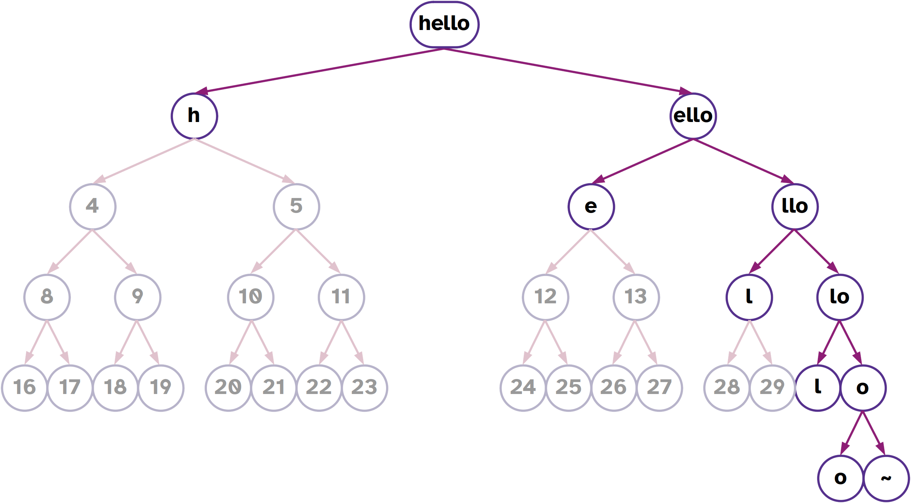

##  Text in Hoon

We've incidentally used `'messages written as cords'` and `"as tapes"`, but aside from taking a brief look at how tapes work with tree addressing, we haven't discussed why these differ or how text works more broadly.

For one thing, there are four basic ways to represent text in Urbit:

- `@t`, a `cord`, which is an atom (single value)
- `@ta`, a `knot` or ASCII text, which is an atom (single value)
- `@tas`, a `term` or ASCII text symbol
- `tape`, which is a `(list @t)`

This is more ways than many languages support:  most languages simply store text directly as a character array, or list of characters in memory.  This most closely approximates a `tape`.

### `@t` `cord`

What is a written character? Essentially it is a representation of human semantic content (not sound strictly). (Note that I do not refer to _alphabets_, which prescribe a particular relationship of sound to symbol: there are ideographic and logographic scripts, syllabaries, and other representations. Thus, _characters_ not _letters_.) Characters can be composed—particularly in ideographic languages like Chinese.


One way to handle text is to assign a code value to each letter, then represent these as subsequent values in memory:

```
65  83  67  73  73
A   S   C   I   I
```

The numeric values used for each letter are the [ASCII](https://en.wikipedia.org/wiki/ASCII) standard, which defines 128 unique characters (2⁷ = 128).

> ### ASCII
> 
> 
> 
> The American Standard Code for Information Interchange was
> developed to allow digital devices to communicate over
> telecomms interfaces in the 1960s.  It has since become the
> _de facto_ standard for representing the basic Latin alphabet.
> 
> Unfortunately, ASCII doesn't support enough characters in 2⁷
> slots to represent many diacritics and special characters,
> standard in many languages.  This led to a longstanding but
> unsatisfactory system of [code pages](https://en.wikipedia.org/wiki/Code_page)
> and ultimately to Unicode.
> 
> [Code page 437](https://en.wikipedia.org/wiki/Code_page_437),
> for instance, is frequently known as "extended ASCII" and will
> look familiar to anyone who has worked with DOS, OS/2, or
> other pre-Windows IBM-compatible systems. (I practically had
> this memorized back when I started programming.)
> 
> 
{: .callout}

It's very helpful to use the `@ux` aura if you are trying to see the internal structure of a `cord`.  Since the ASCII values align at the 8-bit wide characters, you can see each character delineated by a hexadecimal pair.

```hoon
> `@ux`'HELLO'
0x4f.4c4c.4548
> `@ub`'HELLO'
0b100.1111.0100.1100.0100.1100.0100.0101.0100.1000
```

You can think of this a couple of different ways.  One way is to simple think of them as chained together, with the first letter in the rightmost position.  Another is to think of them as values multipled by a “place value”:

| Letter | ASCII | Place | “Place Value” |
| ------ | ----- | ----- | ------------- |
| `H`    | 0x48  | 0     | 2⁰ = 1 → 0x48 |
| `E`    | 0x45  | 1     | 2⁸ = 256 = 0x100 → 0x4500 |
| `L`    | 0x4c  | 2     | 2¹⁶ = 65.536 = 0x1.0000 → 0x4c.0000 |
| `L`    | 0x4c  | 3     | 2²⁴ = 16.777.216 = 0x100.0000 → 0x4c00.0000 |
| `O`    | 0x4f  | 4     | 2³² = 4.294.967.296 = 0x1.0000.0000 → 0x4f.0000.0000 |

This way, each value slots in after the preceding value.

Special characters (non-ASCII, beyond the standard keyboard, basically) are represented using a more complex numbering convention.  Unicode defines a standard specification for _code points_ or numbers assigned to characters, and a few specific bitwise _encodings_ (such as the ubiquitous UTF-8).

Urbit uses UTF-8 for `@t` values (thus both `cord` and `tape`).

> ### Unicode (A Brief Aside)
> 
> Unicode separates code points from encoding. Unicode only 
> specifies the former.
> 
> ```
> U+010F  ď   LATIN SMALL LETTER D WITH CARON
> ```
> 
> Unicode defines a codespace of 1,114,112 code points in the 
> range 0x0 to 0x10.ffff. There are about 170,000 characters 
> specified currently.
> 
> [UTF-8](https://en.wikipedia.org/wiki/UTF-8) is a variable-
> byte encoding, using one to four bytes to represent any
> possible Unicode address.  The first part of UTF-8 matches
> ASCII so they are intercompatible with each other.
> 
> 
> 
> 
> 
> 
> 
> 
> 
> 
>
> -   [Computerphile on Unicode](https://www.youtube.com/watch?v=MijmeoH9LT4)
> -   [Mojibake](https://en.wikipedia.org/wiki/Mojibake), the result of interpreting text with the wrong encoding (pronounce it _mo-ji-ba-ke_)
> -   [Big list of naughty strings](https://github.com/minimaxir/big-list-of-naughty-strings), strings that tend to cause encoding and parsing problems with many software packages and libraries.
{: .callout}

### `(list @t)` `tape`

There are some tools to work with atom `cord`s of text, but most of the time it is more convenient to unpack the atom into a `tape`.  A `tape` splits out the individual characters from a `cord` into a `list` of `@t` values.



We've hinted a bit at the structure of `list`s before; for now the main thing you need to know is that they are cells which end in a `~` sig.  So rather than have all of the text values stored sequentially in a single atom, they are stored sequentially in a rightwards-branching binary tree of cells.

> ### Lists
>
> There are many tools for manipulating text using standard
> string tools.  We'll take a look at those in the next major
> section after “Text”.
{: .callout}

Later on, we'll look at how to convert between the forms of text and the advantages and disadvantages of each.

> ### Can You Trick Hoon?
>
> If a `~` marks the end of a `tape`, can it occur earlier in the
> `tape`?  (Make sure to distinguish the _character_ `~` from the
> _calue_ `~`.)
>
> > ### Solution
> >
> > ```hoon
> > > `(list @t)`['a' 'b' ~ ~]  
> > mint-nice  
> > -need.?(%~ [i=@t t=*''])  
> > -have.[@t @t %~ %~]  
> > nest-fail  
> > dojo: hoon expression failed
> > ```
> {: .solution}
{: .challenge}


### `@ta` `knot`

If we restrict the character set to certain ASCII characters instead of UTF-8, we can use this restricted representation for system labels as well (such as URLs, file system paths, permissions).  `@ta` `knot`s and `@tas` `term`s both fill this role for Hoon.

```hoon
> `@ta`'hello'
~.hello
```

Every valid `@ta` is a valid `@t`, but `@ta` does not permit spaces or a number of other characters.  (See `++sane`, discussed below.)

### `@tas` `term`

A further tweak of the ASCII-only concept, the `@tas` `term` permits only “text constants”, values that 

> [`@tas` permits only] a restricted text atom for Hoon constants. The only characters permitted are lowercase ASCII letters, `-`, and `0-9`, the latter two of which cannot be the first character. The syntax for `@tas` is the text itself, always preceded by `%`. The empty `@tas` has a special syntax, `$`.

`term`s are rarely used for message-like text, but they are used all the time for internal labels in code.  They differ from regular text in a couple of key ways that can confuse you until you're used to them.

For instance, a `@tas` value will _only_ match itself, so they are commonly used with type unions to filter for acceptable values.

```hoon
> ^-  @tas  %5  
mint-nice  
-need.@tas  
-have.%5  
nest-fail  
dojo: hoon expression failed  
> ^-  ?(%5)  %5  
%5
```

For instance, imagine creating a function to ensure that only a certain [classical element]() can pass through a gate:

```hoon
|=  input=@t
=<
(validate-element input)
|%
+$  element  ?(%earth %air %fire %water)
++  validate-element
  |=  incoming=@t
  ^-  element  incoming
--
```

##  Text Operations

The most common needs for text-based data in programming are to _produce_ text, _manipulate_ text, or _analyze_ text.

### Producing Text

Producing text requires 

interpolation

`++weld` can be used to glue two `tape`s together.

```hoon

```

Text can be much more advanced than this.  If you are interested, you can look into `wain`, ``

### Manipulating Text

Common operations include:

- `++crip`: convert `tape` to `cord` (`tape`→`cord`)
- `++trip`: convert `cord` to `tape` (`cord`→`tape`)
- `++cass`: convert upper-case text to lower-case (`tape`→`tape`)
- `++cuss`: convert lower-case text to upper-case (`tape`→`tape`)


### Analyzing Text

You can:

1. Search
2. Tokenize
3. Convert into data

#### Search


> ### Count the Number of Characters in Text
>
> There is a built-in `++lent` function that 
> 
> 
> 
> You may find the [`?~` wutsig](https://urbit.org/docs/hoon/reference/rune/wut#-wutsig) rune to be helpful.  It tells you whether a value is `~` or not.  (How would you do this with a regular `?:` wutcol?)
{: .challenge}

> ### Count the Number of Times a Character Occurs in a Text
>
> Let's build a parser to split a long `tape` into smaller
> `tape`s at single spaces.
{: .challenge}

#### Tokenize/Parse

tokenize
parse
++trim
++

> ### Parsing Text
>
> Hoon has a very powerful text parsing engine, built to compile
> Hoon itself.  However, it tends to be quite obscure to new
> learners.  We can build a simple one using `list` tools, as
> you'll see in the next section.
{: .callout}

#### Convert

- [`++scot`](https://urbit.org/docs/reference/library/4m/#scot): render `dime` as `cord` (`dime`→`cord`)
- [`++scow`](https://urbit.org/docs/reference/library/4m/#scow): render `dime` as `tape` (`dime`→`tape`)

[`++sane`](https://urbit.org/docs/reference/library/4m/#sane) is used to check the validity of a possible text string as a `knot` or `term`.  The usage of `++sane` will feel a bit strange to you:  it doesn't apply directly to the text you want to check, but it produces a gate that checks for the aura (as `%ta` or `%tas`).  (The gate-builder is a fairly common pattern in Hoon.)

```hoon
> ((sane %ta) 'ångstrom')  
%.n  
> ((sane %ta) 'angstrom')  
%.y  
> ((sane %tas) 'ångstrom')  
%.n  
> ((sane %tas) 'angstrom')  
%.y
```

Why is this sort of check necessary?  Two reasons:

1.  `@ta` `knot`s and `@tas` `term`s have strict rules, such as being ASCII-only.
2.  Not every sequence of bits has a conversion to a text representation.  That is, ASCII and Unicode have structural rules that limit the possible conversions which can be made.  If things don't work, you'll get a `%bad-text` response.

    ```hoon
    > 0x1234.5678.90ab.cdef  
    0x1234.5678.90ab.cdef  
    [%bad-text "[39 239 205 171 144 120 86 52 92 49 50 39 0]"]
    ```

There's a minor bug in Dojo that will let you produce an erroneous `term` (`@tas`):

```hoon
> `@tas`'hello mars'
%hello mars
```

Since a `@tas` cannot include a space, this is formally incorrect, as `++sane` reveals:

```hoon
> ((sane %tas) 'hello')  
%.y
> ((sane %tas) 'hello mars')
%.n
```


##  List Operations

The `tape` is a special kind of `list`, actually a `(list @t)`.  Other lists can contain other atom types, generic atoms, other lists (lists of lists), or even generic nouns.

A `list` is an ordered arrangement of elements ending in a `~` (null).  Most lists have the same kind of content in every element (for instance, a `(list @rs)`, a list of numbers with a fractional part), but some lists have many kinds of things within them.  Some lists are even empty.

```hoon
> `(list @)`['a' %b 100 ~]
~[97 98 100]
```

(Notice that all values are converted to the specified aura, in this case the empty aura.)

A `list` is built with the `list` mold.  (Remember that a mold is a type and can be used as an enforcer:  it attempts to convert any data it receives into the given structure, and crashes if it fails to do so.)

Lists are commonly written with a shorthand `~[]`:

```hoon
> `(list)`~['a' %b 100]
~[97 98 100]
```

```hoon
> `(list (list @ud))`~[~[1 2 3] ~[4 5 6]]
~[~[1 2 3] ~[4 5 6]]
```

If something has the same _structure_ as a `list` but hasn't been explicitly labeled as such, then Hoon won't always recognize it as a `list`.  In such cases, you'll need to explicitly mark it as such:

```hoon
> [3 4 5 ~]
[3 4 5 ~]
> `(list @ud)`[3 4 5 ~]
~[3 4 5]
> -:!>([3 4 5 ~])
#t/[@ud @ud @ud %~]
> -:!>(`(list @ud)`[3 4 5 ~])
#t/it(@ud)
```

(See also [`++limo`](https://urbit.org/docs/hoon/reference/stdlib/2b#limo) which marks a null-terminated tuple as a `list`.)

Using `~[]` still doesn't mark it as a `list`, unfortunately, which can lead to some confusion:

```hoon
> -:!>(~['a' %b 100])
#t/[@t %b @ud %~]
> -:!>(`(list)`~['a' %b 100])
#t/it(*)
```

Notice that the type from the type spear `-:!>` shows up as `it()`, short for an “iterator”, or type that can potentially continue as long as the pattern matches.

> ### What is the Structure of a `list` of `list`s?
>
> Draw a binary tree representing the actual tree location of
> values in this data structure:
> 
> ```hoon
> `(list (list @ud))`~[~[1 2 3] ~[4 5 6] ~[7 8 9]]
> ```
{: .challenge}

Once you have your data in the form of a `list`, there are a lot of tools to manipulate and analyze them:

- [`++flop`](https://urbit.org/docs/hoon/hoon-school/lists#flop) reverses the order of the elements (exclusive of the `~`):
  
    ```hoon
    > (flop ~[1 2 3 4 5])
    ~[5 4 3 2 1]
    ```

- [`++sort`](https://urbit.org/docs/hoon/hoon-school/lists#sort) uses a `list` and a comparison function (like `++lth`) to order things:

    ```hoon
    > (sort ~[1 3 5 2 4] lth)
    ~[1 2 3 4 5]
    ```

- [`++snag`](https://urbit.org/docs/hoon/hoon-school/lists#snag) takes a index and a `list` to grab out a particular element (note that it starts counting at zero):

    ```hoon
    > (snag 0 `(list @)`~[11 22 33 44])
    11
    > (snag 1 `(list @)`~[11 22 33 44])
    22
    > (snag 3 `(list @)`~[11 22 33 44])
    44
    > (snag 3 "Hello!")
    'l'
    > (snag 1 "Hello!")
    'e'
    > (snag 5 "Hello!")
    '!'
    ```

There are a couple of sometimes-useful `list` builders:

- [`++gulf`](https://urbit.org/docs/hoon/reference/stdlib/2b#gulf) spans between two numeric values (inclusive of both):

    ```hoon
    > (gulf 5 10)  
    ~[5 6 7 8 9 10]
    ```

- [`++reap`](https://urbit.org/docs/hoon/reference/stdlib/2b#reap) repeats a value many times in a `list`:

    ```hoon
    > (reap 5 0x0)  
    ~[0x0 0x0 0x0 0x0 0x0]
    > (reap 8 'a')  
    <|a a a a a a a a|>  
    > `tape`(reap 8 'a')  
    "aaaaaaaa"
    > (reap 5 (gulf 5 10))  
    ~[~[5 6 7 8 9 10] ~[5 6 7 8 9 10] ~[5 6 7 8 9 10] ~[5 6 7 8 9 10] ~[5 6 7 8 9 10]]  
    ```

Once you have a `list` (including a `tape`), there are a lot of manipulation tools you can use to extract data from it or modify it:

- [`++find`](https://urbit.org/docs/hoon/reference/stdlib/2b#find) `[nedl=(list) hstk=(list)]` locates a sublist (`nedl`, needle) in the list (`hstk`, haystack)
- [`++snag`](https://urbit.org/docs/hoon/reference/stdlib/2b#snag) `[a=@ b=(list)]` produces the element at an index in the list (zero-indexed)
- [`++snap`](https://urbit.org/docs/hoon/reference/stdlib/2b#snap) `[a=(list) b=@ c=*]` replaces the element at an index in the list (zero-indexed) with something else
- [`++scag`](https://urbit.org/docs/hoon/reference/stdlib/2b#scag) `[a=@ b=(list)]` produces the first _a_ elements from the front of the list
- [`++slag`](https://urbit.org/docs/hoon/reference/stdlib/2b#slag) `[a=@ b=(list)]` produces the last _a_ elements from the end of the list
- [`++weld`](https://urbit.org/docs/hoon/reference/stdlib/2b#weld) `[a=(list) b=(list)]` glues two `list`s together (_not_ a single item to the end)

There are a few more that you should pick up eventually, but these are enough to get you started.

Using what we know to date, most operations that we would do on a collection of data require a trap.  However, there are some cool aggregators and applicators:

- [`++roll`](https://urbit.org/docs/hoon/reference/stdlib/2b#roll) `[a=(list) b=gate]` slams a two-argument gate from left to right across a list.

    For instance, to obtain the sum of a list of numbers, use it with `++add`:
    
    ```hoon
    (roll (gulf 1 5) add)
    ```
    
    You could even build a factorial this way:
    
    ```hoon
    |=  n=@ud
    (roll (gulf 1 n) mul)
    ```
    
    (Due to internal optimizations, this is actually much faster than the ones we have written to date!)

- [`++turn`](https://urbit.org/docs/hoon/reference/stdlib/2b#turn) `[a=(list) b=gate]` produces a new list with the gate applied to each element of the original.

    ```hoon
    (turn (gulf 65 90) @t)
    ```
    
    Include the factorial function from a moment ago:
    
    ```hoon
    (turn (gulf 1 20) factorial)
    ```

A few operations in Hoon actually require a `lest`, a `list` guaranteed to be non-null (that is, `~[]` is excluded).

> ### Break Text at a Space
>
> Let's build a parser to split a long `tape` into smaller
> `tape`s at single spaces.  That is, given a `tape`
> 
> ```
> "the sky above the port was the color of television tuned to a dead channel"
> ```
> 
> the gate should yield
> 
> ```
> ~["the" "sky" "above" "the"]
> ```
> 
> To complete this, you'll need [`++scag`](https://urbit.org/docs/hoon/reference/stdlib/2b#scag) and [`++slag`](https://urbit.org/docs/hoon/reference/stdlib/2b#slag) (who sound like
> villainous henchmen from a children's cartoon.
> > ### Solution
> >
> > ```hoon
> > =/  ex  "the sky above the port was the color of television tuned to a dead channel"  
> > =/  index  0  
> > =/  result  *(list tape)  
> > |-  ^-  (list tape)  
> > ?:  =(index (lent ex))  
> >   result  
> > ?:  =((snag index ex) ' ')  
> >   $(index 0, ex `tape`(slag +(index) ex), result (weld result ~[`tape`(scag index ex)]))    
> > $(index +(index))
{: .challenge}


##  Building Your Own Library

As an addendum to our discussion about cores last week, let's take some of the code we've built above for processing text and turn them into a library we can use in another generator.

> ### Build a Library
>
> Take the space-breaking code and the character-counting code 
> gates from above and include them in a `|%` barcen core.  Save
> this file as `lib/text.hoon` in the `%base` desk and commit.
>
> Produce a generator `gen/text-user.hoon` which accepts a `tape`
> and returns the number of words in the text (separated by 
> spaces).  (How would you obtain this from those two 
> operations?)
{: .challenge}

### Logging

The most time-honored method of debugging is to simply output relevant values at key points throughout a program in order to make sure they are doing what you think they are doing.  For this, we introduced `~&` sigpam recently.

The `~&` sigpam rune offers some finer-grained output options than just printing a simple value to the screen.  For instance, you can use it with string interpolation to produce detailed error messages.

There are also `>` modifiers which can be included to mark “debugging levels”, really just color-coding the output:

1.  No `>`:  regular
2.  `>`:  information
3.  `>>`:  warning
4.  `>>>`:  error

(Since all `~&` sigpam output is a side effect of the compiler, it doesn't map to the Unix [`stdout`/`stderr` streams](https://en.wikipedia.org/wiki/Standard_streams) separately; it's all `stdout`.)

You can use these to differentiate messages when debugging or otherwise auditing the behavior of a generator or library.  Try these in your own Dojo:

```hoon
> ~&  'Hello Mars!'  ~  
~  
>   'Hello Mars!'  
> ~&  >  'Hello Mars!'  ~  
~  
>>  'Hello Mars!'  
> ~&  >>  'Hello Mars!'  ~  
~  
>>> 'Hello Mars!'  
> ~&  >>>  'Hello Mars!'  ~  
~
```
